AB Testing
================
Tharun Peddisetty and Sushama Rangarajan

    ##   TimeStamp              SrNo        Gender                    Age     
    ##  Length:553         Min.   :  1   Female:233   21-30 years       :388  
    ##  Class :character   1st Qu.:139   Male  :318   31-40 years       : 87  
    ##  Mode  :character   Median :277   Other :  2   41-50 years       : 18  
    ##                     Mean   :277                Less than 20 years: 31  
    ##                     3rd Qu.:415                More than 50 years: 29  
    ##                     Max.   :553                                        
    ##                                                                        
    ##              Income                 Occupation              Region    AppUsage 
    ##  $100K-$149K    : 39   Employed-Full Time:262   Asia           :331   No :115  
    ##  $10K-$49K      :124   Employed-Part Time: 28   Central America: 19   Yes:438  
    ##  $150K-$199K    :  4   Retired           :  5   Europe         : 10            
    ##  $50K-$99K      : 58   Student           :216   North America  :178            
    ##  Less than $10K :126   Unemployed        : 42   Oceania        :  4            
    ##  More than $200K:  9                            South America  : 11            
    ##  Not Applicable :193                                                           
    ##            OrderFrequency OfferOrder LikePicture PhotoSales      PhotoStyle 
    ##  Daily            :  7    No :224    No :277     No : 48    Restaurant:242  
    ##  Few Times a Month:176    Yes:329    Yes:276     Yes:505    Rustic    :168  
    ##  Few Times a Week : 93                                      Studio    :143  
    ##  Never            :115                                                      
    ##  Occasionally     :162                                                      
    ##                                                                             
    ##                                                                             
    ##    Temptation  Order   Cinemagraph  Interact      Treat        OrderCat
    ##  8      :101   1: 67   May be:166   No :200   Min.   :0.0000   0:323   
    ##  7      : 89   2: 97   No    : 33   Yes:353   1st Qu.:0.0000   1:230   
    ##  10     : 75   3:159   Yes   :354             Median :0.0000           
    ##  6      : 55   4:136                          Mean   :0.3382           
    ##  9      : 54   5: 94                          3rd Qu.:1.0000           
    ##  1      : 42                                  Max.   :1.0000           
    ##  (Other):137                                                           
    ##  TemptationCat
    ##  High  :230   
    ##  Low   :139   
    ##  Medium:184   
    ##               
    ##               
    ##               
    ## 

# Exploratory Data Analysis

# Pie Charts

We can see various Age groups and occupations of the users who
participated in this survey.
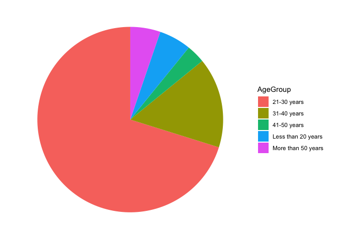<!-- -->

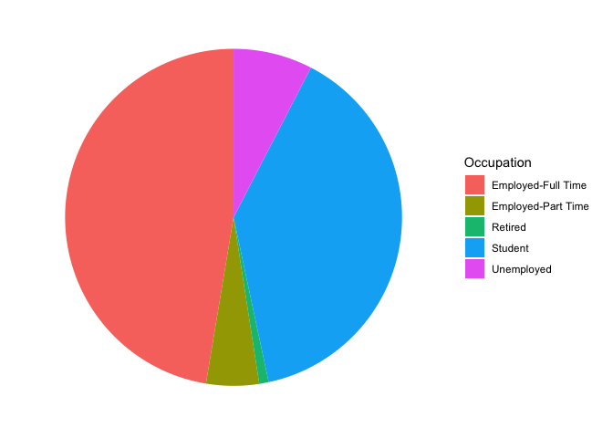<!-- -->

# Plot proportions

Here we can see the Proportion of Temptation Levels in both control and
treatment groups. We can clearly see that Gifs have induces more hunger
temptation levels when compared to the food pictures.

    ## `summarise()` has grouped output by 'Temptation'. You can override using the `.groups` argument.

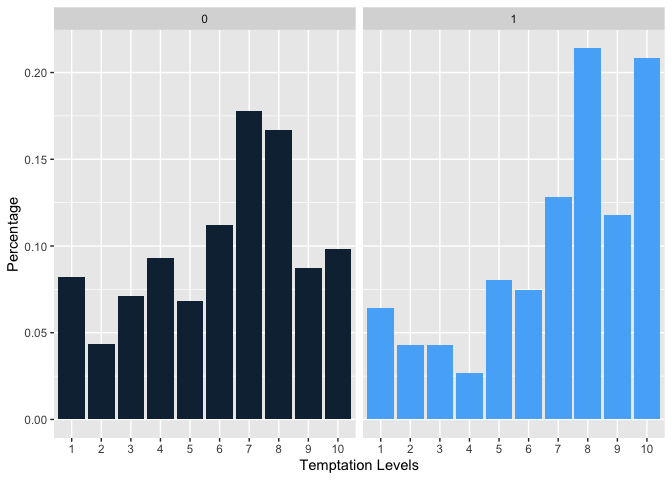<!-- -->

# Box Plot 1

The boxplot clearly shows that as the temptation levels increase, the
order likelihood also increases. We can see how the median temptations
levels increase as the order likelihood increases.
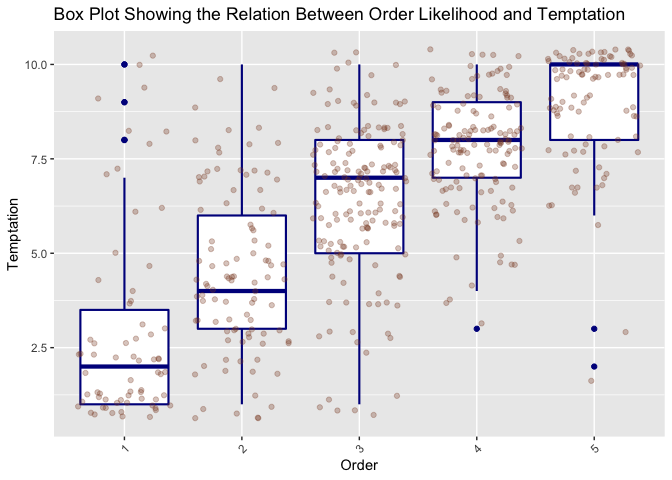<!-- -->

Similar results can be observed when the boxplot is split into control
and treatment groups.We can see how Gifs create more probability of
order the food compared to the pictures.This is especially observed in
the highly likely category of Orders.
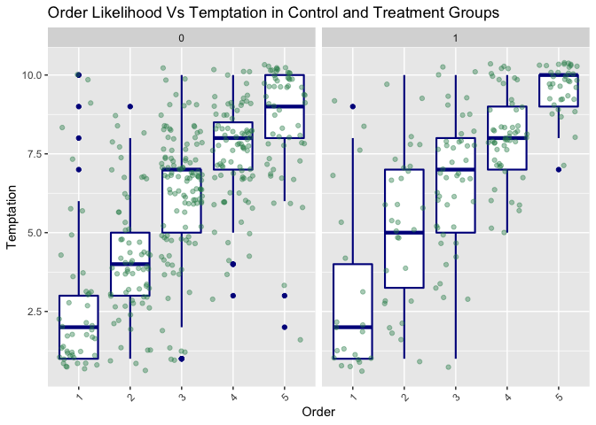<!-- -->

# PhotoStyle

This barplot shows how the users prefered restaurant style pictures/Gifs
compared to Rustic and Studio style.
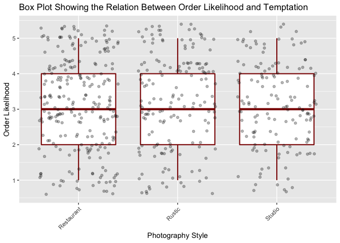<!-- -->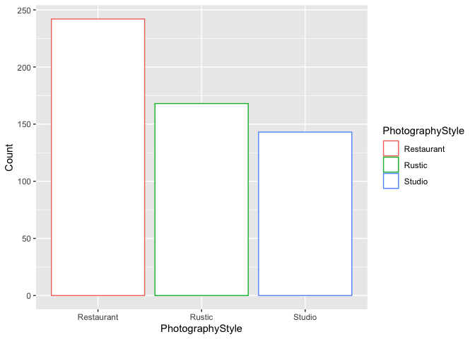<!-- -->
Similar trend can be observed in both treatment and control groups
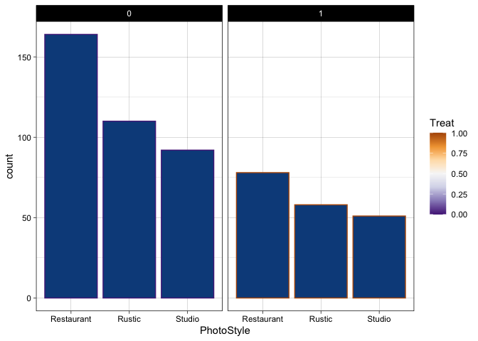<!-- -->

# Interact : Evidence that People want something more to interact with the items like 360 degrees image

Question in the survey: Would you like to interact with food photograph?
e.g. 360 degrees, Moving image, Controlling the image The above question
was asked in the end, by which point the user has already chose nhis
likelihood of temptation and order. We can see from the box plot that,
for the people in the control group, who have seem only food pictures,
their idea regarding the interaction with photography is limited hence
their responses are mixed. But, when we look at the box plot for
treatment, we know that they have been subjected to food Gif by this
point and they have some clue as to how that affected their choice and
most of them would like to have something more to interact with the food
items (like 360 degrees images). This provides us a base to say that
better interaction capability in the Apps will give rise to elevated
temptation levels and increase in food orders.
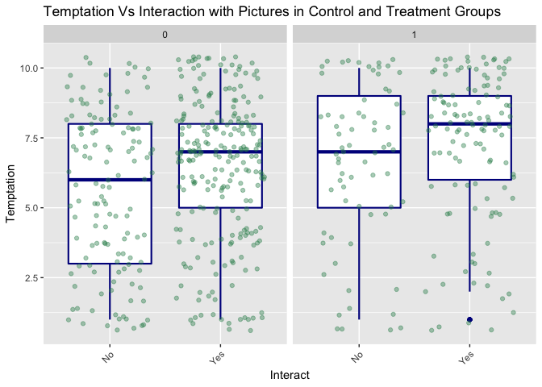<!-- -->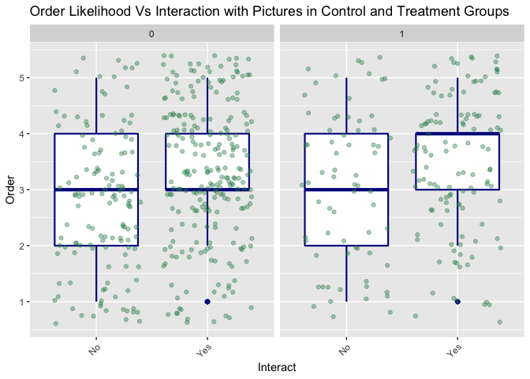<!-- -->

\#Cinemagraphs : After showing the Gifs it looks like people seemed to
like more graphical representation of the items on the App Question in
the survey: Do you think cinemagraphs are a good way of displaying food?
Upon plotting the box plot for control and treatment groups we find that
those who are in favour of the idea of cinemagraphs have higher
temptation for food in both the groups.
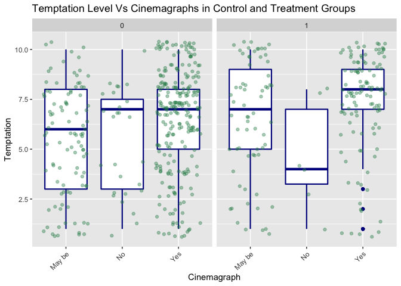<!-- -->

# Like Picture

This boxplot clearly distinguishes the difference the Gifs make to the
users like or dislike to take pictures of their food. 0/1 on the top of
graphs indicate Control/Treatment groups. We can clearly see that the
median value for the temptation which is around 7.5 level is the same
for 2 groups of people who liked/disliked to take the pictures of their
food. Whereas in the treatment group, we can see that for the people who
did not like to take picture Gifs were able to induce same temptation
level as that of the control group. For the ones who liked to take
pictures their temptation levels elevated. Therefore, we can say that
Gif’s induce more hunger and temptation in both the clusters of people
who like/dislike to take pictures of his/her food.
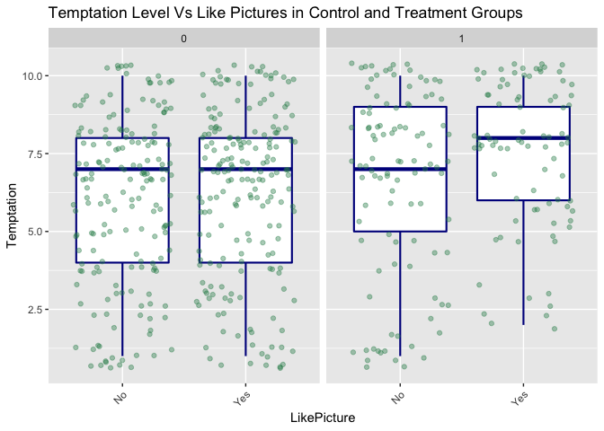<!-- -->

# Propensity Score Matching

In order to compare similar set of people in both treatment and control
group, we have matched people based on their Age, Income and Region. We
used 1-to-many matching in this case. This has been done to eliminate
the possibility of treatment and control groups being different in their
behaviour. Also, this method ensures to capture any common trend between
the groups and keep is out of the picture.

    ## 
    ## Call:
    ## matchit(formula = Treat ~ Age + Income + Region + LikePicture + 
    ##     PhotoStyle + OrderFrequency, data = data1, method = "optimal")
    ## 
    ## Summary of Balance for All Data:
    ##                                 Means Treated Means Control Std. Mean Diff.
    ## distance                               0.4329        0.2897          0.8538
    ## Age21-30 years                         0.7754        0.6639          0.2671
    ## Age31-40 years                         0.1123        0.1803         -0.2155
    ## Age41-50 years                         0.0481        0.0246          0.1100
    ## AgeLess than 20 years                  0.0321        0.0683         -0.2055
    ## AgeMore than 50 years                  0.0321        0.0628         -0.1745
    ## Income$100K-$149K                      0.0749        0.0683          0.0249
    ## Income$10K-$49K                        0.1711        0.2514         -0.2131
    ## Income$150K-$199K                      0.0107        0.0055          0.0509
    ## Income$50K-$99K                        0.0749        0.1202         -0.1723
    ## IncomeLess than $10K                   0.1390        0.2732         -0.3878
    ## IncomeMore than $200K                  0.0107        0.0191         -0.0820
    ## IncomeNot Applicable                   0.5187        0.2623          0.5132
    ## RegionAsia                             0.5775        0.6093         -0.0643
    ## RegionCentral America                  0.0053        0.0492         -0.6010
    ## RegionEurope                           0.0214        0.0164          0.0345
    ## RegionNorth America                    0.3743        0.2951          0.1638
    ## RegionOceania                          0.0000        0.0109         -0.1290
    ## RegionSouth America                    0.0214        0.0191          0.0157
    ## LikePictureNo                          0.5455        0.4781          0.1352
    ## LikePictureYes                         0.4545        0.5219         -0.1352
    ## PhotoStyleRestaurant                   0.4171        0.4481         -0.0628
    ## PhotoStyleRustic                       0.3102        0.3005          0.0208
    ## PhotoStyleStudio                       0.2727        0.2514          0.0480
    ## OrderFrequencyDaily                    0.0214        0.0082          0.0912
    ## OrderFrequencyFew Times a Month        0.3209        0.3169          0.0084
    ## OrderFrequencyFew Times a Week         0.1551        0.1749         -0.0547
    ## OrderFrequencyNever                    0.1765        0.2240         -0.1248
    ## OrderFrequencyOccasionally             0.3262        0.2760          0.1072
    ##                                 Var. Ratio eCDF Mean eCDF Max
    ## distance                            1.0219    0.2260   0.3932
    ## Age21-30 years                           .    0.1115   0.1115
    ## Age31-40 years                           .    0.0680   0.0680
    ## Age41-50 years                           .    0.0235   0.0235
    ## AgeLess than 20 years                    .    0.0362   0.0362
    ## AgeMore than 50 years                    .    0.0308   0.0308
    ## Income$100K-$149K                        .    0.0066   0.0066
    ## Income$10K-$49K                          .    0.0802   0.0802
    ## Income$150K-$199K                        .    0.0052   0.0052
    ## Income$50K-$99K                          .    0.0454   0.0454
    ## IncomeLess than $10K                     .    0.1342   0.1342
    ## IncomeMore than $200K                    .    0.0084   0.0084
    ## IncomeNot Applicable                     .    0.2564   0.2564
    ## RegionAsia                               .    0.0317   0.0317
    ## RegionCentral America                    .    0.0438   0.0438
    ## RegionEurope                             .    0.0050   0.0050
    ## RegionNorth America                      .    0.0792   0.0792
    ## RegionOceania                            .    0.0109   0.0109
    ## RegionSouth America                      .    0.0023   0.0023
    ## LikePictureNo                            .    0.0673   0.0673
    ## LikePictureYes                           .    0.0673   0.0673
    ## PhotoStyleRestaurant                     .    0.0310   0.0310
    ## PhotoStyleRustic                         .    0.0096   0.0096
    ## PhotoStyleStudio                         .    0.0214   0.0214
    ## OrderFrequencyDaily                      .    0.0132   0.0132
    ## OrderFrequencyFew Times a Month          .    0.0039   0.0039
    ## OrderFrequencyFew Times a Week           .    0.0198   0.0198
    ## OrderFrequencyNever                      .    0.0476   0.0476
    ## OrderFrequencyOccasionally               .    0.0502   0.0502
    ## 
    ## 
    ## Summary of Balance for Matched Data:
    ##                                 Means Treated Means Control Std. Mean Diff.
    ## distance                               0.4329        0.3939          0.2326
    ## Age21-30 years                         0.7754        0.7754          0.0000
    ## Age31-40 years                         0.1123        0.1230         -0.0339
    ## Age41-50 years                         0.0481        0.0428          0.0250
    ## AgeLess than 20 years                  0.0321        0.0374         -0.0303
    ## AgeMore than 50 years                  0.0321        0.0214          0.0607
    ## Income$100K-$149K                      0.0749        0.0749          0.0000
    ## Income$10K-$49K                        0.1711        0.2299         -0.1562
    ## Income$150K-$199K                      0.0107        0.0000          0.1040
    ## Income$50K-$99K                        0.0749        0.0963         -0.0813
    ## IncomeLess than $10K                   0.1390        0.1711         -0.0927
    ## IncomeMore than $200K                  0.0107        0.0053          0.0520
    ## IncomeNot Applicable                   0.5187        0.4225          0.1926
    ## RegionAsia                             0.5775        0.5561          0.0433
    ## RegionCentral America                  0.0053        0.0053          0.0000
    ## RegionEurope                           0.0214        0.0321         -0.0739
    ## RegionNorth America                    0.3743        0.3957         -0.0442
    ## RegionOceania                          0.0000        0.0000          0.0000
    ## RegionSouth America                    0.0214        0.0107          0.0739
    ## LikePictureNo                          0.5455        0.5348          0.0215
    ## LikePictureYes                         0.4545        0.4652         -0.0215
    ## PhotoStyleRestaurant                   0.4171        0.4599         -0.0868
    ## PhotoStyleRustic                       0.3102        0.2781          0.0694
    ## PhotoStyleStudio                       0.2727        0.2620          0.0240
    ## OrderFrequencyDaily                    0.0214        0.0107          0.0739
    ## OrderFrequencyFew Times a Month        0.3209        0.3155          0.0115
    ## OrderFrequencyFew Times a Week         0.1551        0.1551          0.0000
    ## OrderFrequencyNever                    0.1765        0.2032         -0.0701
    ## OrderFrequencyOccasionally             0.3262        0.3155          0.0228
    ##                                 Var. Ratio eCDF Mean eCDF Max Std. Pair Dist.
    ## distance                            1.1028    0.0447   0.1925          0.2398
    ## Age21-30 years                           .    0.0000   0.0000          0.2888
    ## Age31-40 years                           .    0.0107   0.0107          0.4742
    ## Age41-50 years                           .    0.0053   0.0053          0.4247
    ## AgeLess than 20 years                    .    0.0053   0.0053          0.3338
    ## AgeMore than 50 years                    .    0.0107   0.0107          0.2428
    ## Income$100K-$149K                        .    0.0000   0.0000          0.1497
    ## Income$10K-$49K                          .    0.0588   0.0588          0.7242
    ## Income$150K-$199K                        .    0.0107   0.0107          0.1040
    ## Income$50K-$99K                          .    0.0214   0.0214          0.5283
    ## IncomeLess than $10K                     .    0.0321   0.0321          0.4019
    ## IncomeMore than $200K                    .    0.0053   0.0053          0.1560
    ## IncomeNot Applicable                     .    0.0963   0.0963          0.5994
    ## RegionAsia                               .    0.0214   0.0214          0.8228
    ## RegionCentral America                    .    0.0000   0.0000          0.0000
    ## RegionEurope                             .    0.0107   0.0107          0.3696
    ## RegionNorth America                      .    0.0214   0.0214          0.8619
    ## RegionOceania                            .    0.0000   0.0000          0.0000
    ## RegionSouth America                      .    0.0107   0.0107          0.2218
    ## LikePictureNo                            .    0.0107   0.0107          0.7947
    ## LikePictureYes                           .    0.0107   0.0107          0.7947
    ## PhotoStyleRestaurant                     .    0.0428   0.0428          0.9327
    ## PhotoStyleRustic                         .    0.0321   0.0321          0.7861
    ## PhotoStyleStudio                         .    0.0107   0.0107          0.9126
    ## OrderFrequencyDaily                      .    0.0107   0.0107          0.2218
    ## OrderFrequencyFew Times a Month          .    0.0053   0.0053          0.7904
    ## OrderFrequencyFew Times a Week           .    0.0000   0.0000          0.2674
    ## OrderFrequencyNever                      .    0.0267   0.0267          0.6593
    ## OrderFrequencyOccasionally               .    0.0107   0.0107          0.8213
    ## 
    ## Percent Balance Improvement:
    ##                                 Std. Mean Diff. Var. Ratio eCDF Mean eCDF Max
    ## distance                                   72.8     -352.5      80.2     51.0
    ## Age21-30 years                            100.0          .     100.0    100.0
    ## Age31-40 years                             84.3          .      84.3     84.3
    ## Age41-50 years                             77.3          .      77.3     77.3
    ## AgeLess than 20 years                      85.2          .      85.2     85.2
    ## AgeMore than 50 years                      65.2          .      65.2     65.2
    ## Income$100K-$149K                         100.0          .     100.0    100.0
    ## Income$10K-$49K                            26.7          .      26.7     26.7
    ## Income$150K-$199K                        -104.5          .    -104.5   -104.5
    ## Income$50K-$99K                            52.8          .      52.8     52.8
    ## IncomeLess than $10K                       76.1          .      76.1     76.1
    ## IncomeMore than $200K                      36.6          .      36.6     36.6
    ## IncomeNot Applicable                       62.5          .      62.5     62.5
    ## RegionAsia                                 32.6          .      32.6     32.6
    ## RegionCentral America                     100.0          .     100.0    100.0
    ## RegionEurope                             -114.0          .    -114.0   -114.0
    ## RegionNorth America                        73.0          .      73.0     73.0
    ## RegionOceania                             100.0          .     100.0    100.0
    ## RegionSouth America                      -372.3          .    -372.3   -372.3
    ## LikePictureNo                              84.1          .      84.1     84.1
    ## LikePictureYes                             84.1          .      84.1     84.1
    ## PhotoStyleRestaurant                      -38.1          .     -38.1    -38.1
    ## PhotoStyleRustic                         -233.7          .    -233.7   -233.7
    ## PhotoStyleStudio                           49.9          .      49.9     49.9
    ## OrderFrequencyDaily                        18.9          .      18.9     18.9
    ## OrderFrequencyFew Times a Month           -36.6          .     -36.6    -36.6
    ## OrderFrequencyFew Times a Week            100.0          .     100.0    100.0
    ## OrderFrequencyNever                        43.8          .      43.8     43.8
    ## OrderFrequencyOccasionally                 78.7          .      78.7     78.7
    ## 
    ## Sample Sizes:
    ##           Control Treated
    ## All           366     187
    ## Matched       187     187
    ## Unmatched     179       0
    ## Discarded       0       0

# T-tests

From the two sample t-test(two tailed) on the overall dataset, we can
see that the difference in means from Treatment and Control groups on
the likelihood of Orders is significant at 10% and Temptation is
significant at 5%

    ## 
    ##  Welch Two Sample t-test
    ## 
    ## data:  as.numeric(Order) by Treat
    ## t = -1.684, df = 366.68, p-value = 0.09303
    ## alternative hypothesis: true difference in means is not equal to 0
    ## 95 percent confidence interval:
    ##  -0.41249924  0.03191422
    ## sample estimates:
    ## mean in group 0 mean in group 1 
    ##        3.103825        3.294118

    ## 
    ##  Welch Two Sample t-test
    ## 
    ## data:  as.numeric(Temptation) by Treat
    ## t = -3.6228, df = 368.78, p-value = 0.0003323
    ## alternative hypothesis: true difference in means is not equal to 0
    ## 95 percent confidence interval:
    ##  -1.3492457 -0.3998557
    ## sample estimates:
    ## mean in group 0 mean in group 1 
    ##        6.114754        6.989305

# Post Matching

The t-test results on matched dataset, shows that the difference in
means between Treatment and Control is significant at 5% for both
Temptation and Order.

This statistically proves that Gifs induced more hunger and improves the
likelihood to order when compared to images.

    ## 
    ##  Welch Two Sample t-test
    ## 
    ## data:  as.numeric(Order) by Treat
    ## t = -2.1041, df = 370.48, p-value = 0.03605
    ## alternative hypothesis: true difference in means is not equal to 0
    ## 95 percent confidence interval:
    ##  -0.51726468 -0.01749468
    ## sample estimates:
    ## mean in group 0 mean in group 1 
    ##        3.026738        3.294118

    ## 
    ##  Welch Two Sample t-test
    ## 
    ## data:  as.numeric(Temptation) by Treat
    ## t = -3.1812, df = 371.4, p-value = 0.00159
    ## alternative hypothesis: true difference in means is not equal to 0
    ## 95 percent confidence interval:
    ##  -1.4104536 -0.3328619
    ## sample estimates:
    ## mean in group 0 mean in group 1 
    ##        6.117647        6.989305

# Model Finalized

We believe regression based approach will give us better results and
help us in understanding the true effect of Gifs on the customers’
hunger. Since the survey has been design to capture the likelihood of
the user’s Temptation and Ordering, we ran an Ordered Multinomial Logit
Regression. This form of regression doesn’t considered Order likelihood
of 1-5 as constinuous variable but as an ordered categorical variable.

The problem with this form of regression is that the interpretation of
the estiamtes becomes extremely complex and not quite intuitive. For
example: We can see that the beta estimate for Treat Varaible is 0.72
which is significant at 5%. The interpretation is as follows: For the
people who saw Gifs the log of odds of them being unlikely tempted when
compred to other levels of temptations (levels from 2-10) decreases by
0.72 compared to the people who saw only food pictures.

In simpler terms, upon seeing a Food Gif in the App, the log odds of a
person being in the unlikely tempted category decreases by 0.72 when
compared to the users who did not see the Food Gifs.

    ## Call:
    ## polr(formula = Temptation ~ Treat + Age + PhotoStyle + LikePicture + 
    ##     Cinemagraph, data = data1[match == TRUE], Hess = T)
    ## 
    ## Coefficients:
    ##                         Value Std. Error t value
    ## Treat                  0.7186     0.1879  3.8248
    ## Age31-40 years        -0.4423     0.3026 -1.4617
    ## Age41-50 years        -1.2759     0.5455 -2.3391
    ## AgeLess than 20 years -0.3449     0.4986 -0.6917
    ## AgeMore than 50 years -1.6999     0.5762 -2.9500
    ## PhotoStyleRustic      -0.1138     0.2247 -0.5065
    ## PhotoStyleStudio      -0.4615     0.2350 -1.9638
    ## LikePictureYes         0.3487     0.1873  1.8617
    ## CinemagraphNo         -0.6104     0.4183 -1.4591
    ## CinemagraphYes         0.4801     0.2060  2.3298
    ## 
    ## Intercepts:
    ##      Value   Std. Error t value
    ## 1|2  -2.2499  0.2995    -7.5121
    ## 2|3  -1.7643  0.2769    -6.3708
    ## 3|4  -1.2411  0.2611    -4.7540
    ## 4|5  -0.7939  0.2524    -3.1454
    ## 5|6  -0.4080  0.2481    -1.6444
    ## 6|7   0.0550  0.2463     0.2232
    ## 7|8   0.7083  0.2493     2.8418
    ## 8|9   1.6358  0.2624     6.2329
    ## 9|10  2.3906  0.2803     8.5301
    ## 
    ## Residual Deviance: 1597.083 
    ## AIC: 1635.083

# Temptation Model Exp Interpretation

To make it much more intuitive in building a story about our analysis,
we took the exponent of all the estimates. The effect of the other
factors in the likelihood to order can now be explained as : 1) For the
users who saw the Gifs, the odds of them highly likely to be tempted to
eat is 2.1 times than the users who saw only the pictures in the Survey.
2) For the users in the Age groups of 41-50 years and More than 50
years, the odds of them highly likely to be tempted to eat is 0.28 and
0.18 times respectively than user of age group 21-30 years. This means
that as the age increases the likelihood to be highly tempted to order
decreases and the age group of 21-30 are highly tempted to order food
looking at the graphics(photo/Gifs). 3) For the users who usually like
Studio photography, the odds of them highly likely to be tempted to eat
is 0.63 times than that of the users who like Restaurant style
photography. This implies that users are more inclined towards
Restaurant style of photography rather than professional style. 4) For
the users who like to see more cinemagraphs, the odds of them highly
likely to be tempted to eat is 1.62 times than that of the users who are
not really sure about it.

    ##                        Estimate
    ## Treat                 2.0516235
    ## Age31-40 years        0.6425292
    ## Age41-50 years        0.2791764
    ## AgeLess than 20 years 0.7083174
    ## AgeMore than 50 years 0.1827008
    ## PhotoStyleRustic      0.8924057
    ## PhotoStyleStudio      0.6303319
    ## LikePictureYes        1.4171874
    ## CinemagraphNo         0.5431247
    ## CinemagraphYes        1.6161587

# Order Model

    ## Call:
    ## polr(formula = Order ~ Treat + OfferOrder + PhotoSales + Income, 
    ##     data = data1[match == TRUE], Hess = T)
    ## 
    ## Coefficients:
    ##                         Value Std. Error t value
    ## Treat                  0.3437     0.1879  1.8291
    ## OfferOrderYes          0.4138     0.1945  2.1276
    ## PhotoSalesYes          0.8592     0.3257  2.6383
    ## Income$10K-$49K       -0.9908     0.3959 -2.5025
    ## Income$150K-$199K     -0.7388     1.2189 -0.6061
    ## Income$50K-$99K       -1.2527     0.4578 -2.7362
    ## IncomeLess than $10K  -0.5435     0.4106 -1.3239
    ## IncomeMore than $200K -1.3876     1.1216 -1.2371
    ## IncomeNot Applicable  -0.6445     0.3608 -1.7865
    ## 
    ## Intercepts:
    ##     Value   Std. Error t value
    ## 1|2 -1.5772  0.4611    -3.4203
    ## 2|3 -0.4548  0.4519    -1.0063
    ## 3|4  0.8283  0.4545     1.8226
    ## 4|5  2.2612  0.4651     4.8617
    ## 
    ## Residual Deviance: 1134.508 
    ## AIC: 1160.508

# Exp(Order Estimates)

The effect of the other factors in the likelihood to order can be
explained as : 1) For the users who saw the Gifs, the odds of them
highly likely to Order is 1.41 times than that of the users who saw only
the pictures in the Survey. 2) For the users who think in app
promotional offers prompt them to order food more, the odds of them
highly likely to Order is 1.51 times than that of the users who doesn’t
care about the offers. 3) For the users who think picutres play a huge
part in selling food, the odds of them highly likely to Order is 2.36
times than the users who think otherwise. 4) For the users with the
Income levels NoIncome, $10K-$49K and $50K-$99K, the odds of them highly
likely to Order is 0.52,0.37 and 0.28 times respectively than the users
of income level $100K-$149K. This implies that No income category users
potentially students in our data tend to order more.

    ##                        Estimate
    ## Treat                 1.4101676
    ## OfferOrderYes         1.5126200
    ## PhotoSalesYes         2.3613761
    ## Income$10K-$49K       0.3712934
    ## Income$150K-$199K     0.4777082
    ## Income$50K-$99K       0.2857449
    ## IncomeLess than $10K  0.5806880
    ## IncomeMore than $200K 0.2496762
    ## IncomeNot Applicable  0.5249100
